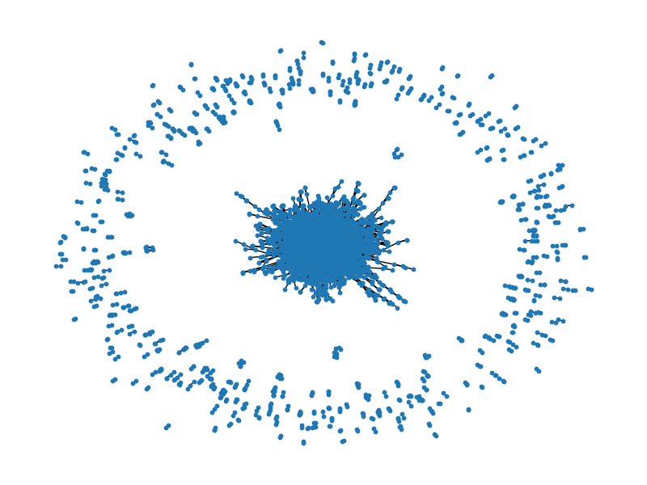
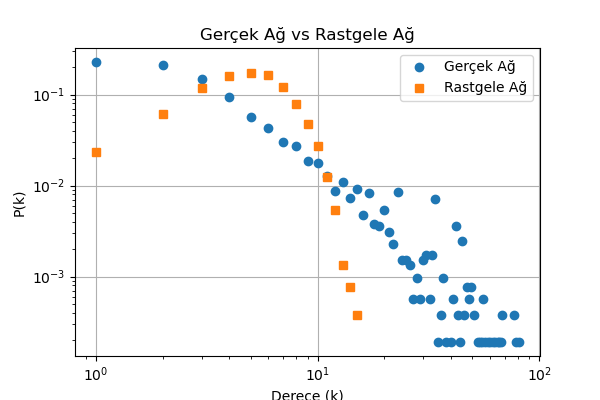
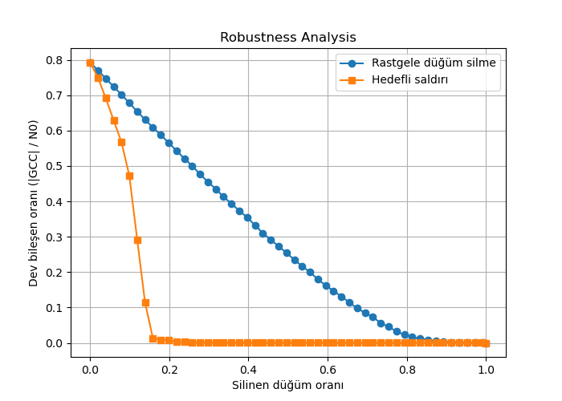

# ELE568-Network-Theory-Projects
ELE568 Network Theory Projects

🔬 Network Science Analysis — arXiv GR-QC Collaboration Network
📌 Overview

This project analyzes the arXiv GR-QC (General Relativity and Quantum Cosmology) co-authorship network using graph theory and network science metrics.

Each node represents an author, and edges represent co-authorship relationships.

The goal is to uncover:

Structural properties of the network
Presence of scale-free behavior
Small-world characteristics
Network robustness under failures and attacks
Community structure and hidden organization

Dataset: SNAP Stanford — ca-GrQc

-🧠 Key Findings (TL;DR)
-📉 Scale-Free Network → γ ≈ 2.04
-🌍 Small-World Property → High clustering + short paths
-🧨 Robust yet Fragile
-Resistant to random failures
-Extremely vulnerable to targeted attacks
-🔗 Assortative Mixing → r ≈ 0.65
-🧩 Community Structure Detected → Modularity ≈ 0.51

## 1. Network Structure (Macro View)

Dense core + sparse outer nodes → clear hub structure

  

## 2. Degree Distribution (Real vs Random)

  

**Interpretation:**
- Real network shows heavy-tail distribution
- Random network shows Poisson-like behavior
- Confirms scale-free nature

## 3. Robustness Analysis

  

**Interpretation:**
- Random node removal → gradual degradation
- Targeted attack → rapid collapse

Critical thresholds:

Random failure: ~0.83
Targeted attack: ~0.18
